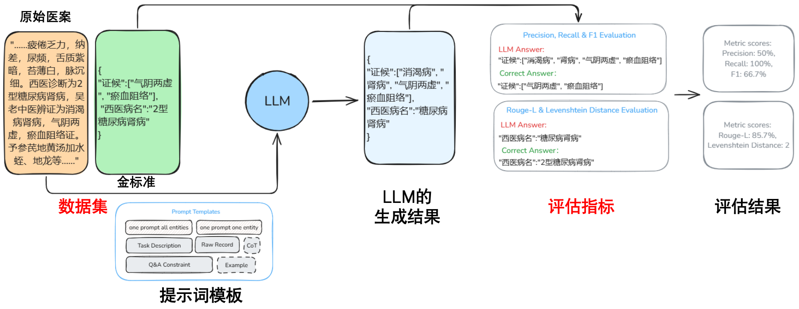

## Language

- [English](#english)
- [中文](#中文)

---

### English

# TCMRIE: A Benchmark for Evaluating Large Language Models in Traditional Chinese Medicine Record Information Extraction

TCMRIE is a comprehensive benchmark designed to assess the performance of large language models on the task of information extraction from Traditional Chinese Medicine (TCM) records.

## Dataset
The TCMRIE dataset encompasses original TCM record texts along with their corresponding structured extraction results. Notably, the dataset has been meticulously reviewed and validated by TCM professionals to ensure accuracy and relevance.

## Evaluation Metrics
We employ commonly used evaluation metrics from other information extraction tasks, with enhancements tailored to the nuances of TCM record information extraction.

## Capabilities of TCMRIE

By leveraging TCMRIE, you can:
- Benchmark the performance of various large language models on TCM record information extraction tasks.
- Compare the effectiveness of different models in this specialized domain.

Below is a visual representation of the performance of some well-known models on the TCMRIE benchmark:

## Upcoming Enhancements
We are actively working on augmenting TCMRIE with additional evaluation models and conducting final quality checks on the dataset. We aim to release the updated benchmark shortly.

---

### 中文

# TCMRIE：评估中医医案信息抽取大型语言模型的基准

TCMRIE 是一个全面的基准测试，旨在评估大语言模型在中医医案信息抽取任务中的表现。

## 数据集
TCMRIE 数据集包含原始中医医案文本及其相应的结构化提取结果。该数据集经过中医专业人员的严格审查和验证，以确保准确性和相关性。

## 评估指标
我们采用其他信息提取任务中常用的评估指标，并针对中医医案信息抽取的细微差别进行了增强。

## TCMRIE 的功能

通过利用 TCMRIE，您可以：
- 对各种大型语言模型在中医案录信息抽取任务上的表现进行基准测试。
- 比较不同模型在此专业领域的有效性。

以下是一些知名模型在 TCMRIE 基准上的表现的直观表示：

## 即将推出的增强功能
我们正在积极努力通过其他评估模型增强 TCMRIE，并对数据集进行最终质量检查。我们的目标是尽快发布更新后的基准。
