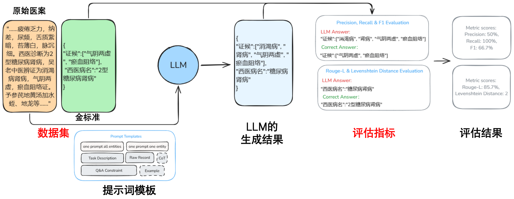
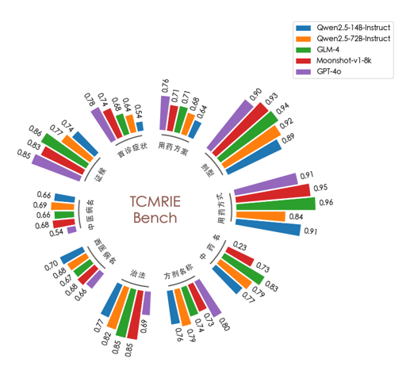

# Coming soon ...

TCMRIE is a comprehensive benchmark designed to assess the performance of large language models on the task of information extraction from Traditional Chinese Medicine (TCM) records.

## Dataset
The TCMRIE dataset encompasses original TCM record texts along with their corresponding structured extraction results. Notably, the dataset has been meticulously reviewed and validated by TCM professionals to ensure accuracy and relevance.

## Evaluation Metrics
We employ commonly used evaluation metrics from other information extraction tasks, with enhancements tailored to the nuances of TCM record information extraction.

## Capabilities of TCMRIE

By leveraging TCMRIE, you can:
- Benchmark the performance of various large language models on TCM record information extraction tasks.
- Compare the effectiveness of different models in this specialized domain.

Below is a visual representation of the performance of some well-known models on the TCMRIE benchmark:

## Upcoming Enhancements

We are actively working on augmenting TCMRIE with additional evaluation models and conducting final quality checks on the dataset. We aim to release the updated benchmark shortly.
