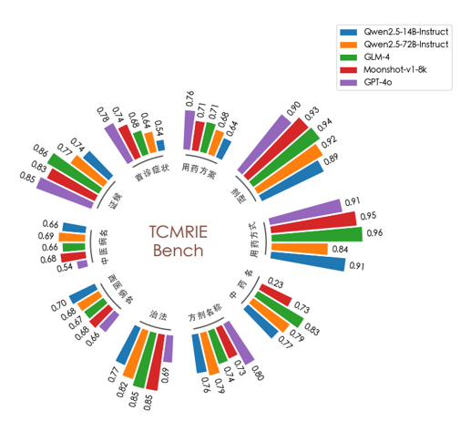

# Coming soon ...

TCMRIE 是一个用于评估大语言模型在中医医案信息抽取任务中表现的基准测试。

## 数据集
TCMRIE 数据集包含原始中医医案文本及其相应的结构化提取结果。该数据集经过中医专业人员的严格审查和验证，以确保准确性和相关性。

## 评估指标
我们采用其他信息提取任务中常用的评估指标，并针对中医医案信息抽取的细微差别进行了增强。

## TCMRIE 的功能

通过利用 TCMRIE，您可以：
- 对各种大型语言模型在中医案录信息抽取任务上的表现进行基准测试。
- 比较不同模型在此专业领域的有效性。

以下是一些知名模型在 TCMRIE 基准上的表现的直观表示：

## 即将推出的增强功能
我们正在积极努力通过其他评估模型增强 TCMRIE，并对数据集进行最终质量检查。我们的目标是尽快发布更新后的基准。
